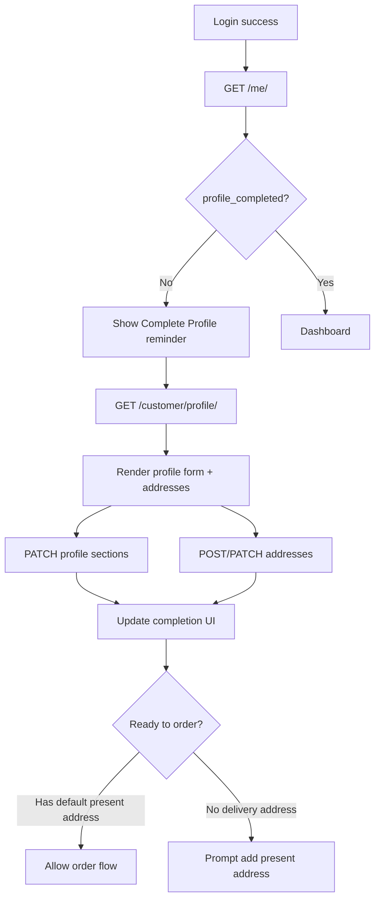

# Customer Extended Profile API

## 1. Feature overview

This feature lets a logged-in customer view and update profile information **after registration**.

**Initial registration** only requires:

- email
- password

Optional at signup (compatibility window): `first_name`, `last_name`, `phone`, `occupation`, `is_bachelor`.

After login, clients collect onboarding fields progressively via `PATCH /user_management/customer/profile/` (immediate persistence per step). Extended food/delivery fields continue to use the same endpoint.

**Authentication:** Token auth (`Authorization: Token <token>`), same as customer auth.

**Base prefix:** `/user_management/`

### Completion concepts

| Key | Meaning |
| --- | --- |
| `onboarding_completion` | Derived name/phone/occupation/`is_bachelor`/gender status |
| `profile_completed` / `profile_completion_percentage` | Extended food/delivery completion (≥ 80%) |

---

## 2. Why this data is collected

| Data area | Purpose |
| --- | --- |
| Personal info | Better meal planning and customer understanding |
| Occupation details | Context for organization/school/workplace |
| Food preferences & allergies | Safe and suitable meal preparation |
| Delivery address & instructions | Accurate food delivery |
| Emergency contact | Customer safety and support |
| Profile completion | Encourage customers to finish setup before ordering |

---

## 3. CustomerProfile fields (PATCH)

These fields live on `CustomerProfile` / related `User` and can be updated via `PATCH /user_management/customer/profile/`.

### Onboarding fields (progressive)

| Field | Type | Required on update | Notes |
| --- | --- | --- | --- |
| `first_name` | string | No | Stored on `User`; trimmed |
| `last_name` | string | No | Stored on `User`; trimmed |
| `phone` | string (10 digits) | No | Unique when set; nullable |
| `occupation` | string (choice) | No | See occupation choices; nullable |
| `is_bachelor` | boolean / null | No | Bachelor/marital proxy; nullable when unset |
| `gender` | string (choice) | No | See gender choices |

### Extended fields

| Field | Type | Required on update | Notes |
| --- | --- | --- | --- |
| `birth_date` | date (`YYYY-MM-DD`) | No | Cannot be a future date |
| `height_cm` | decimal | No | Centimeters, must be positive if provided. Example: `170.50` |
| `weight_kg` | decimal | No | Kilograms, must be positive if provided. Example: `65.50` |
| `emergency_contact_name` | string (max 100) | No | |
| `emergency_contact_phone` | string (10 digits) | No | Bangladesh phone only, no `+880` |
| `organization_name` | string (max 255) | No | Meaning depends on occupation |
| `academic_year_or_position` | string (max 100) | No | Meaning depends on occupation |
| `has_allergy` | boolean | No | Default `false` |
| `allergy_details` | text | Required if `has_allergy=true` | Example: `peanuts, shrimp, milk` |
| `restricted_foods` | text | No | Foods customer does not eat |
| `preferred_food_type` | string (choice) | No | See choice values |
| `spice_level` | string (choice) | No | See choice values |
| `religious` | string (choice) | No | See choice values |
| `delivery_instruction` | text | No | Example: `Call before delivery` |
| `preferred_delivery_time` | time (`HH:MM` or `HH:MM:SS`) | No | Example: `13:30` |
| `profile_completed` | boolean | Read-only | Auto-calculated, `true` when completion >= 80% |
| `profile_completion_percentage` | integer (0–100) | Read-only | Auto-calculated |
| `is_email_verified` | boolean | Read-only | Set only by email verification |

GET/PATCH responses also include `onboarding_completion` (`completed`, `missing_fields`, `completion_percentage`).

Frontend guide: `user_management/docs/frontend/progressive-customer-onboarding.md`.

---

## 4. CustomerAddress fields

| Field | Type | Required | Notes |
| --- | --- | --- | --- |
| `id` | integer | Read-only | Address ID |
| `address_type` | string (choice) | Yes | `present` or `permanent` |
| `full_address` | text | Yes | Main address line |
| `city` | string | No | Default backend value: `Dhaka` |
| `area` | string | No | Example: `Mirpur`, `Dhanmondi` |
| `building_name` | string | No | |
| `floor` | string | No | Example: `5th Floor` |
| `flat_number` | string | No | Example: `A-5` |
| `landmark` | string | No | Nearby known place |
| `latitude` | decimal | No | Example: `23.810331` |
| `longitude` | decimal | No | Example: `90.412521` |
| `is_default_delivery` | boolean | No | Default `false`; only for `present` addresses |
| `created_at` | datetime | Read-only | |
| `updated_at` | datetime | Read-only | |

### Address business rules

- A customer can have **one permanent** address and **one or more present** addresses.
- **Present** addresses are used for delivery.
- Only **one** address per customer can have `is_default_delivery=true`.
- The **first present address** is automatically set as default delivery.
- Setting a new default unsets the previous default.
- Permanent addresses cannot be default delivery.
- Deleting the default delivery address does not crash; another present address may become default if available.

---

## 5. Choice values

### `gender`

| Value | Label |
| --- | --- |
| `male` | Male |
| `female` | Female |
| `other` | Other |
| `prefer_not_to_say` | Prefer not to say |

### `occupation` (from registration, read-only in profile update)

| Value | Label |
| --- | --- |
| `student` | Student |
| `job_holder` | Job Holder |
| `freelancer` | Freelancer |
| `business_owner` | Business Owner |
| `unemployed` | Unemployed |
| `other` | Other |

### `preferred_food_type`

| Value | Label |
| --- | --- |
| `regular` | Regular |
| `vegetarian` | Vegetarian |
| `non_vegetarian` | Non Vegetarian |
| `halal` | Halal |
| `low_spicy` | Low Spicy |
| `high_protein` | High Protein |
| `diabetic_friendly` | Diabetic Friendly |
| `custom` | Custom |

### `spice_level`

| Value | Label |
| --- | --- |
| `no_spice` | No Spice |
| `mild` | Mild |
| `medium` | Medium |
| `spicy` | Spicy |

### `religious`

| Value | Label |
| --- | --- |
| `islam` | Islam |
| `hinduism` | Hinduism |
| `buddhism` | Buddhism |
| `christianity` | Christianity |
| `other` | Other |
| `prefer_not_to_say` | Prefer not to say |

### `address_type`

| Value | Label |
| --- | --- |
| `present` | Present (delivery) |
| `permanent` | Permanent |

---

## 6. API endpoint list

| Method | Endpoint | Description |
| --- | --- | --- |
| `GET` | `/user_management/customer/profile/` | Get extended profile + addresses + completion |
| `PATCH` | `/user_management/customer/profile/` | Update extended profile fields |
| `GET` | `/user_management/customer/addresses/` | List own addresses |
| `POST` | `/user_management/customer/addresses/` | Create address |
| `GET` | `/user_management/customer/addresses/<id>/` | Get one address |
| `PATCH` | `/user_management/customer/addresses/<id>/` | Update address |
| `DELETE` | `/user_management/customer/addresses/<id>/` | Delete address |
| `POST` | `/user_management/customer/addresses/<id>/set-default/` | Set default delivery address |

**Related existing endpoint (updated):**

| Method | Endpoint | Change |
| --- | --- | --- |
| `GET` | `/user_management/me/` | Now includes `profile_completion_percentage` and `profile_completed` in `customer_profile` |

**Swagger/OpenAPI tag:** `Customer Profile`

---

## 7. Request examples

### GET profile

```http
GET /user_management/customer/profile/
Authorization: Token <your_token>
```

### PATCH profile

```http
PATCH /user_management/customer/profile/
Authorization: Token <your_token>
Content-Type: application/json
```

```json
{
  "birth_date": "2000-05-15",
  "gender": "male",
  "height_cm": "170.50",
  "weight_kg": "65.50",
  "emergency_contact_name": "Rahim Uddin",
  "emergency_contact_phone": "1812345678",
  "organization_name": "Dhaka University",
  "academic_year_or_position": "3rd Year",
  "has_allergy": true,
  "allergy_details": "Shrimp and peanuts",
  "restricted_foods": "Beef, too spicy food",
  "preferred_food_type": "regular",
  "spice_level": "medium",
  "religious": "islam",
  "delivery_instruction": "Call before delivery",
  "preferred_delivery_time": "13:30"
}
```

### POST present address

```http
POST /user_management/customer/addresses/
Authorization: Token <your_token>
Content-Type: application/json
```

```json
{
  "address_type": "present",
  "full_address": "House 12, Road 5, Mirpur",
  "city": "Dhaka",
  "area": "Mirpur",
  "building_name": "Green Tower",
  "floor": "5th Floor",
  "flat_number": "A-5",
  "landmark": "Beside Mirpur Mosque",
  "latitude": "23.810331",
  "longitude": "90.412521",
  "is_default_delivery": true
}
```

### POST permanent address

```json
{
  "address_type": "permanent",
  "full_address": "Village home, Comilla",
  "city": "Comilla",
  "area": "Homna"
}
```

### PATCH address

```json
{
  "landmark": "Opposite Mirpur Stadium",
  "is_default_delivery": true
}
```

### POST set default delivery

```http
POST /user_management/customer/addresses/3/set-default/
Authorization: Token <your_token>
```

No request body required.

---

## 8. Response examples

### GET `/user_management/customer/profile/` — 200 OK

```json
{
  "user": {
    "id": 1,
    "email": "customer@example.com",
    "first_name": "Rahim",
    "last_name": "Uddin"
  },
  "customer_profile": {
    "phone": "1712345678",
    "occupation": "student",
    "is_bachelor": true,
    "is_email_verified": true,
    "birth_date": "2000-05-15",
    "gender": "male",
    "height_cm": "170.50",
    "weight_kg": "65.50",
    "emergency_contact_name": "Rahim Uddin",
    "emergency_contact_phone": "1812345678",
    "organization_name": "Dhaka University",
    "academic_year_or_position": "3rd Year",
    "has_allergy": true,
    "allergy_details": "Shrimp and peanuts",
    "restricted_foods": "Beef, too spicy food",
    "preferred_food_type": "regular",
    "spice_level": "medium",
    "religious": "islam",
    "delivery_instruction": "Call before delivery",
    "preferred_delivery_time": "13:30:00",
    "profile_completed": true,
    "profile_completion_percentage": 90,
    "created_at": "2026-07-01T10:00:00Z",
    "updated_at": "2026-07-10T09:00:00Z"
  },
  "addresses": [
    {
      "id": 1,
      "address_type": "present",
      "full_address": "House 12, Road 5, Mirpur",
      "city": "Dhaka",
      "area": "Mirpur",
      "building_name": "Green Tower",
      "floor": "5th Floor",
      "flat_number": "A-5",
      "landmark": "Beside Mirpur Mosque",
      "latitude": "23.810331",
      "longitude": "90.412521",
      "is_default_delivery": true,
      "created_at": "2026-07-10T08:00:00Z",
      "updated_at": "2026-07-10T08:00:00Z"
    }
  ],
  "profile_completion_percentage": 90,
  "profile_completed": true
}
```

### PATCH `/user_management/customer/profile/` — 200 OK

Same shape as GET profile response.

### GET `/user_management/customer/addresses/` — 200 OK

```json
[
  {
    "id": 1,
    "address_type": "present",
    "full_address": "House 12, Road 5, Mirpur",
    "city": "Dhaka",
    "area": "Mirpur",
    "building_name": "Green Tower",
    "floor": "5th Floor",
    "flat_number": "A-5",
    "landmark": "Beside Mirpur Mosque",
    "latitude": "23.810331",
    "longitude": "90.412521",
    "is_default_delivery": true,
    "created_at": "2026-07-10T08:00:00Z",
    "updated_at": "2026-07-10T08:00:00Z"
  }
]
```

### POST `/user_management/customer/addresses/` — 201 Created

Returns a single address object (same shape as list item).

### POST `/user_management/customer/addresses/<id>/set-default/` — 200 OK

Returns the updated address object with `is_default_delivery: true`.

### GET `/user_management/me/` — updated snippet

```json
{
  "user": {
    "id": 1,
    "email": "customer@example.com",
    "first_name": "Rahim",
    "last_name": "Uddin"
  },
  "groups": ["CUSTOMER"],
  "customer_profile": {
    "phone": "1712345678",
    "occupation": "student",
    "is_bachelor": true,
    "is_email_verified": true,
    "profile_completion_percentage": 40,
    "profile_completed": false
  },
  "is_authenticated": true
}
```

---

## 9. Validation rules

### CustomerProfile

| Rule | Error field |
| --- | --- |
| `birth_date` cannot be in the future | `birth_date` |
| `height_cm` must be positive if provided | `height_cm` |
| `weight_kg` must be positive if provided | `weight_kg` |
| `emergency_contact_phone` must be exactly 10 digits | `emergency_contact_phone` |
| `emergency_contact_phone` must contain digits only | `emergency_contact_phone` |
| `gender` must be a valid choice | `gender` |
| `preferred_food_type` must be a valid choice | `preferred_food_type` |
| `spice_level` must be a valid choice | `spice_level` |
| `religious` must be a valid choice | `religious` |
| If `has_allergy=true`, `allergy_details` is required | `allergy_details` |

### CustomerAddress

| Rule | Error field |
| --- | --- |
| `address_type` is required | `address_type` |
| `full_address` is required and cannot be blank | `full_address` |
| Only `present` addresses can be default delivery | `is_default_delivery` |
| Only one default delivery address per customer | handled by backend automatically |

---

## 10. Error responses

### 401 Unauthorized

```json
{
  "detail": "Authentication credentials were not provided."
}
```

### 403 Forbidden — no customer profile

```json
{
  "detail": "Customer profile not found for this account."
}
```

### 404 Not Found — another customer's address

```json
{
  "detail": "Not found."
}
```

### 400 Bad Request — validation example

```json
{
  "birth_date": ["Birth date cannot be in the future."]
}
```

```json
{
  "emergency_contact_phone": ["Emergency Contact Phone must be exactly 10 digits and digits only."]
}
```

```json
{
  "allergy_details": ["Allergy details are required when has_allergy is true."]
}
```

```json
{
  "full_address": ["Full address is required."]
}
```

```json
{
  "is_default_delivery": ["Only present addresses can be set as default delivery."]
}
```

```json
{
  "detail": "Only present addresses can be set as default delivery."
}
```

---

## 11. Profile completion logic

Completion is recalculated automatically after:

- `PATCH /user_management/customer/profile/`
- Address create / update / delete
- `GET /user_management/customer/profile/` (refresh on read)

### Important fields (10 total, 10% each)

| # | Field | Completed when |
| --- | --- | --- |
| 1 | `birth_date` | Value is set |
| 2 | `gender` | Value is set |
| 3 | Delivery address | Customer has a **present** address with `is_default_delivery=true` |
| 4 | `emergency_contact_phone` | Value is set |
| 5 | `organization_name` | Value is set |
| 6 | Allergy info | If `has_allergy=false`, counts as complete; if `true`, `allergy_details` must be filled |
| 7 | `restricted_foods` | Non-empty text |
| 8 | `preferred_food_type` | Value is set |
| 9 | `religious` | Value is set |
| 10 | `preferred_delivery_time` | Value is set |

### Result

- `profile_completion_percentage`: integer `0` to `100`
- `profile_completed`: `true` when percentage **>= 80**

Example: 8 of 10 fields complete → `80%` → `profile_completed: true`

---

## 12. Frontend implementation notes

### Recommended page

Create a **Complete Profile** page after login:

**Suggested route:** `/account/profile`

Load data from:

```text
GET /user_management/customer/profile/
```

Save profile sections with:

```text
PATCH /user_management/customer/profile/
```

Manage addresses with the address endpoints.

### Suggested UI sections

#### 1. Personal Information

- `birth_date` — date picker, max = today
- `gender` — select
- `height_cm` — number input
- `weight_kg` — number input

#### 2. Occupation Information

- `occupation` — read-only from registration
- `organization_name` — label depends on occupation
- `academic_year_or_position` — label depends on occupation

**Occupation-dependent labels:**

| Occupation | Organization label | Position/year label |
| --- | --- | --- |
| `student` | School/College/University Name | Year/Semester/Class |
| `job_holder` | Company Name | Job Position/Designation |
| `freelancer` | Platform or Business Name (optional) | Skill/Category |
| `business_owner` | Business/Company Name | Role/Title |
| `unemployied` / `other` | Organization/Details (optional) | Details (optional) |

#### 3. Food Preference

- `has_allergy` — checkbox/toggle
- `allergy_details` — textarea, **show only when** `has_allergy=true`
- `restricted_foods` — textarea
- `preferred_food_type` — select
- `spice_level` — select
- `religious` — select

#### 4. Delivery Information

Use address APIs for:

- present address (`address_type: present`)
- building_name, floor, flat_number, landmark
- map picker optional for latitude/longitude

Use profile PATCH for:

- `delivery_instruction`
- `preferred_delivery_time`

#### 5. Emergency Contact

- `emergency_contact_name`
- `emergency_contact_phone` — 10 digits only, no `+880`

### Address UI behavior

- Allow adding **present** addresses (delivery).
- Allow adding **permanent** address (optional).
- Allow setting **one present address** as default delivery.
- Show which address is default delivery.
- Use default/present address later for order delivery.

### Important frontend behavior

| Scenario | Frontend action |
| --- | --- |
| `profile_completion_percentage < 80` | Show profile completion reminder/banner |
| Before ordering | Check profile; suggest adding delivery address if missing |
| Phone inputs | Exactly 10 digits, no country code |
| Birth date | Block future dates client-side too |
| `has_allergy=true` | Require/show `allergy_details` |
| After profile or address save | Re-read `profile_completion_percentage` from response |

### Suggested frontend flow



### TypeScript-friendly shapes (optional)

```typescript
type Gender = 'male' | 'female' | 'other' | 'prefer_not_to_say';
type PreferredFoodType = 'regular' | 'vegetarian' | 'non_vegetarian' | 'halal' | 'low_spicy' | 'high_protein' | 'diabetic_friendly' | 'custom';
type SpiceLevel = 'no_spice' | 'mild' | 'medium' | 'spicy';
type Religion = 'islam' | 'hinduism' | 'buddhism' | 'christianity' | 'other' | 'prefer_not_to_say';
type AddressType = 'present' | 'permanent';

interface CustomerAddress {
  id: number;
  address_type: AddressType;
  full_address: string;
  city: string;
  area: string;
  building_name: string;
  floor: string;
  flat_number: string;
  landmark: string;
  latitude: string | null;
  longitude: string | null;
  is_default_delivery: boolean;
  created_at: string;
  updated_at: string;
}

interface ExtendedProfileResponse {
  user: { id: number; email: string; first_name: string; last_name: string };
  customer_profile: Record<string, unknown>;
  addresses: CustomerAddress[];
  profile_completion_percentage: number;
  profile_completed: boolean;
}
```

---

## 13. Manual Postman test steps

### Prerequisites

1. Register a customer via `POST /user_management/customer/register/`
2. Verify email via `GET /user_management/verify-email/<uid>/<token>/`
3. Login via `POST /user_management/login/`
4. Copy the `token` from login response

Set Postman header for all steps below:

```text
Authorization: Token <copied_token>
```

### Test steps

| Step | Action | Expected |
| --- | --- | --- |
| 1 | `GET /user_management/customer/profile/` | `200`, empty/null extended fields, `profile_completion_percentage: 0` |
| 2 | `PATCH /user_management/customer/profile/` with extended fields | `200`, fields updated, completion increases |
| 3 | `POST /user_management/customer/addresses/` with `address_type: present` | `201`, address created |
| 4 | Create second present address, then `POST /user_management/customer/addresses/<id>/set-default/` | `200`, only that address has `is_default_delivery: true` |
| 5 | `GET /user_management/customer/profile/` again | Completion percentage updated |
| 6 | `PATCH` with `emergency_contact_phone: "17abc"` | `400` validation error |
| 7 | `PATCH` with future `birth_date` | `400` validation error |
| 8 | Login as another customer, try `GET /user_management/customer/addresses/<other_id>/` | `404` |
| 9 | `PATCH` with `has_allergy: true` and empty `allergy_details` | `400` |
| 10 | `POST` address with blank `full_address` | `400` |

---

## Quick integration checklist for frontend

- [ ] Build `/account/profile` page
- [ ] Use `GET /customer/profile/` on page load
- [ ] Save each section with `PATCH /customer/profile/`
- [ ] CRUD addresses via `/customer/addresses/`
- [ ] Use `POST /customer/addresses/<id>/set-default/` for default delivery
- [ ] Show reminder when `profile_completion_percentage < 80`
- [ ] Before order, ensure default present address exists
- [ ] Read completion from `/me/` for navbar/dashboard badge if needed

---

## Notes

- Registration API is unchanged.
- Existing customers continue working; new fields default to empty/null/0/false.
- Swagger docs are available under the **`Customer Profile`** tag in the project's OpenAPI schema.
- This document covers **customer extended profile only**; meals, orders, payment, wallet, delivery, notifications, and promotions are out of scope here.
