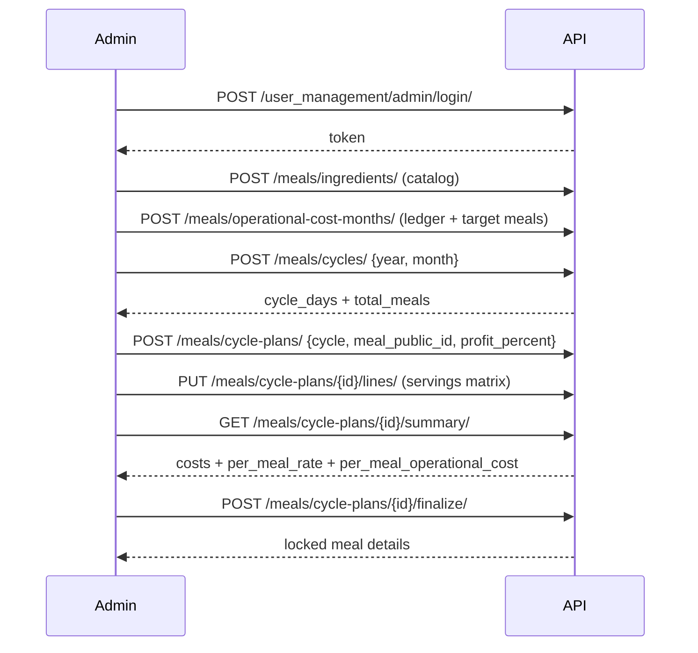

# Meal Cycle Management (Admin)

## 1. What is this?

This feature lets **verified admins** plan and cost monthly meal packages the same way the Excel sheet (`menu analaytic chart.xlsx`) works — organized by **calendar month**.

**Simple idea:**

1. Pick a month (example: April 2026 → 30 days → **60 meals**, because 2 meals/day).
2. Pick a meal package (`MealCategory`).
3. For each food product, enter **how many times** it will be served in that month.
4. The system calculates product cost, other cost, profit, total, and **per meal rate**.
5. When the plan looks right, **finalize** it to lock the numbers **and publish** the package price onto the meal (`MealCategory.total_price`).

**Who can use cycle APIs:** verified admin only (`ADMIN` group + verified `AdminProfile`).  
**Customers / public:** use public meal list/detail (with `current_cycle_offering` after finalize). Cycle admin endpoints remain private.

**Auth (admin):** `Authorization: Token <admin_token>`  
**Admin login:** `POST /user_management/admin/login/` — see [admin-auth-api.md](../../../docs/admin-auth-api.md).

**Base path:** `/meals/`

**Breaking change:** meal create no longer requires (or writes) `total_price`. Price comes from cycle finalize only.

---

## 2. Mental model

```
Ingredient (product catalog: pricing + visibility)
        │
        ▼
MealCycle (2026-04 → 30 days → 60 meals)
        │
        ▼
MealCyclePlan (one meal package inside that month)
        │
        ▼
MealCyclePlanLine (product + servings_count + product_role)
        │
        ▼
Summary / Finalize → meal details + money totals
                    → publishes MealCategory.total_price
```

| Concept | Meaning |
| --- | --- |
| Ingredient | Food product (Beef, Chicken, Rice, Vegetables…) — no global serving role |
| `is_customer_visible` | When `false`, still costs on plans but omitted from customer/public menus |
| MealCycle | One calendar month’s cycle |
| `total_meals` | `days_in_month × 2` |
| MealCyclePlan | Costing plan for one meal package in that cycle |
| `product_role` | Per plan-line role: `main` / `side` / `staple` / `seasoning` / `other` |
| `servings_count` | How many times that product is served in the cycle |
| Finalize | Lock plan snapshots **and** set meal `total_price = snapshot_total_cost` |
| Reopen | Unlock plan for edits; **keeps** last published meal price until next finalize |

---

## 3. Month → meals rule

| Month example | Days | Total meals |
| --- | --- | --- |
| January 2026 | 31 | **62** |
| April 2026 | 30 | **60** |
| February 2026 (non-leap) | 28 | **56** |

Formula: `total_meals = calendar_days(year, month) × 2`

---

## 4. Money formulas (Excel-compatible)

All money math uses `Decimal` (not float).

### Unit cost components

**Kg-derived (resolved):**

```text
resolved_cost_per_customer = price_per_kg ÷ customers_per_kg   # null if no kg pair
```

Example: Beef `650 ÷ 12 = 54.166667`

**Flat cooking / piece cost:**

```text
cost_per_customer = stored flat cost_per_customer   # null if unset
```

Both may be present on the same ingredient. They are **additive**, not alternatives.

### Line and package totals

```text
line_product_cost = (resolved_cost_per_customer + cost_per_customer) × servings_count
                    # missing side treated as 0 in the sum
product_cost      = sum(line_product_cost)
other_cost        = expected_servings × per_meal_operational_cost
                    # from OperationalCostMonth for the cycle year/month
profit            = product_cost × (profit_percent / 100)       # default 10%
total_cost        = product_cost + other_cost + profit
per_meal_rate     = total_cost ÷ plan_expected_servings
```

```text
per_meal_operational_cost = total_operational_cost ÷ target_meal_quantity
```

Examples:

- Kg only: `(54.166667 + 0) × 2`
- Flat only: `(0 + 6.00) × 60`
- Both: `(54.166667 + 2.00) × 10`
- July op cost: total `310000` / target `10000` → per-meal `31`; package other_cost for 60 servings → `1860`

**BREAKING:** `other_cost_percent` is removed. Other cost is absolute operational allocation, not a percent of product cost. Summary/finalize require an `OperationalCostMonth` for the cycle’s year/month (empty items allowed → per-meal `0.00`).

See [`operational-costs.md`](./operational-costs.md) for ledger APIs and admin cost preview.

Optional purchasing hint (not the primary input):

```text
estimated_kg = servings_count ÷ customers_per_kg   # only if customers_per_kg exists
```

### Finalize rule

Sum of `servings_count` for **plan lines** with `product_role = main` **must equal** the plan’s expected servings (package meal-period aware; for monthly `both` this is typically `cycle.total_meals`).

Example (April, monthly both): main plan-line servings must total **60**.

The same ingredient may be `main` on Package A and `side` on Package D in the same month — role is plan-scoped.

---

## 5. Permissions

| Caller | Access |
| --- | --- |
| Superuser | Full |
| Verified admin | Full |
| Customer | `403` |
| Unauthenticated | `401` |

Permission class: `IsVerifiedAdmin`

---

## 6. Key models / fields

### Ingredient

| Field | Required | Meaning |
| --- | --- | --- |
| `name` | yes | Unique product name |
| `price_per_kg` | no* | Purchase price per kg |
| `customers_per_kg` | with price | Customers served by 1 kg |
| `cost_per_customer` | no* | Optional flat per-serving cooking cost (one customer or one piece); **added** to kg-resolved cost when both exist |
| `pieces_per_kg` | no | Optional piece count |
| `is_active` | no | Default `true`; inactive cannot be added to new draft lines |
| `is_customer_visible` | no | Default `true`; when `false`, omit from customer/public menus (still costed) |
| `resolved_cost_per_customer` | read-only | Kg-only unit cost (`price_per_kg / customers_per_kg`); `null` when no kg pair (does **not** fall back to flat) |

Pricing rule (catalog):

- Provide **both** kg fields, **and/or** optional flat `cost_per_customer`, **or neither** (unpriced catalog row).
- Incomplete kg pair (only one of the two) is rejected.
- Meal-cycle plan lines / summary / finalize **require** at least one pricing source (kg pair and/or flat).
- Line math: `(resolved_cost_per_customer + cost_per_customer) × servings_count` (missing side = 0). See also [`../frontend/additive-ingredient-line-cost.md`](../frontend/additive-ingredient-line-cost.md).

**Breaking:** `product_role` is **not** on the ingredient. Set it on each plan line.

### MealCycle

| Field | Meaning |
| --- | --- |
| `year`, `month` | Unique pair |
| `cycle_days` | Auto from calendar |
| `total_meals` | Auto = days × 2 |

### MealCyclePlan

| Field | Meaning |
| --- | --- |
| `cycle` | FK to MealCycle |
| `meal_category` | Meal package (read FK); create with write-only `meal_public_id` UUID |
| `profit_percent` | Default `10.00` (override per package, e.g. `20`) |
| `status` | `draft` or `finalized` |
| `snapshot_*` | Locked totals after finalize (includes absolute `snapshot_other_cost`) |

### MealCyclePlanLine

| Field | Meaning |
| --- | --- |
| `plan` | Parent plan |
| `ingredient` | Product |
| `product_role` | Required: `main` / `side` / `staple` / `seasoning` / `other` |
| `servings_count` | Times served (≥ 0) |

Unique: one ingredient once per plan.

---

## 7. Endpoint grid

| Method | Endpoint | Why |
| --- | --- | --- |
| CRUD | `/meals/ingredients/` | Product catalog |
| CRUD | `/meals/operational-cost-months/` | Monthly op-cost ledger + target meals |
| `PUT` | `/meals/operational-cost-months/{public_id}/items/` | Replace ledger items |
| CRUD | `/meals/cycles/` | Create month cycles |
| CRUD | `/meals/cycle-plans/` | Plan per package/month |
| CRUD | `/meals/cycle-plan-lines/` | Single line edits |
| `PUT` | `/meals/cycle-plans/{public_id}/lines/` | Replace full servings matrix |
| `GET` | `/meals/cycle-plans/{public_id}/summary/` | Live or snapshot meal details |
| `POST` | `/meals/cycle-plans/{public_id}/cost-preview/` | One-meal admin cost preview |
| `POST` | `/meals/cycle-plans/{public_id}/finalize/` | Lock plan |
| `POST` | `/meals/cycle-plans/{public_id}/reopen/` | Unlock for edits |

Swagger tags: **Admin Meal Cycle**, **Admin Operational Cost** (`/api/docs/`).

> Legacy `/meals/recipes/` (kg-quantity recipes) was **removed**. Use cycle plans + servings instead.

---

## 8. Full admin workflow (call order)



### Step-by-step

1. **Login** as verified admin → save token.
2. **Create ingredients** (once; reuse every month).
3. **Create a cycle** for the target year/month.
4. **Create a plan** linking that cycle to a meal package; set profit % if needed.
5. **Set servings** with bulk `PUT .../lines/` (Excel-style matrix).
6. **Review** `GET .../summary/`.
7. **Finalize** when main servings sum equals `total_meals`.
8. Later edits: `POST .../reopen/` → edit → finalize again.

---

## 9. Request / response examples

### 9.1 Create kg ingredient

`POST /meals/ingredients/`

```json
{
  "name": "Beef",
  "price_per_kg": "650.00",
  "customers_per_kg": "12.00",
  "pieces_per_kg": 70,
  "is_customer_visible": true
}
```

Success `201` (important fields):

```json
{
  "id": 1,
  "name": "Beef",
  "price_per_kg": "650.00",
  "customers_per_kg": "12.00",
  "resolved_cost_per_customer": "54.166667",
  "is_active": true,
  "is_customer_visible": true
}
```

### 9.2 Create flat-cost / costing-only ingredient

```json
{
  "name": "Masala Cost",
  "cost_per_customer": "2.00",
  "is_customer_visible": false
}
```

Customer menus omit this item; plan costing still includes it when added as a plan line.

### 9.2b Create ingredient without pricing

```json
{
  "name": "Unpriced Spice",
  "is_customer_visible": false
}
```

Success `201`: `cost_per_customer`, kg fields, and `resolved_cost_per_customer` are `null`.  
Do **not** add this ingredient to a plan line until pricing is set — line create/replace and summary/finalize return `400` with `ingredient` errors.

### 9.3 Create April cycle

`POST /meals/cycles/`

```json
{ "year": 2026, "month": 4 }
```

Success `201`:

```json
{
  "id": 1,
  "year": 2026,
  "month": 4,
  "cycle_days": 30,
  "total_meals": 60,
  "notes": ""
}
```

January returns `cycle_days: 31`, `total_meals: 62`.

### 9.4 Create plan

`POST /meals/cycle-plans/`

```json
{
  "cycle": 1,
  "meal_public_id": "aaaaaaaa-bbbb-cccc-dddd-eeeeeeeeeeee",
  "profit_percent": "20.00"
}
```

Write identity for the meal package is UUID `meal_public_id` (not integer `meal_category`). Responses still include integer `meal_category` plus `meal_category_detail`.


### 9.5 Bulk replace servings (matrix)

`PUT /meals/cycle-plans/1/lines/`

```json
{
  "lines": [
    { "ingredient": 1, "servings_count": 2, "product_role": "main" },
    { "ingredient": 3, "servings_count": 18, "product_role": "main" },
    { "ingredient": 10, "servings_count": 60, "product_role": "staple" }
  ]
}
```

Each line **requires** `product_role`. Missing role → `400`.

### 9.6 Summary (draft = live prices)

`GET /meals/cycle-plans/1/summary/`

Returns `status`, cycle info, lines with `product_role` / `cost_per_customer` / `line_product_cost`, plus `product_cost`, `other_cost`, `profit`, `total_cost`, `per_meal_rate`, `suggested_package_price`, `published_meal_total_price`, `published_price_status`, `published_price_delta`, and (when stale) `realized_profit_margin_percent`.

| Field | Meaning |
| --- | --- |
| `total_cost` | Live-calculated on draft plans; snapshot on finalized plans |
| `suggested_package_price` | Always equals `total_cost` (informational alias) |
| `published_meal_total_price` | Current `MealCategory.total_price` — what customers pay until re-finalize |
| `published_price_status` | `in_sync` when published equals `total_cost`; `stale` when they differ |
| `published_price_delta` | `total_cost − published_meal_total_price` when stale; `null` when in sync |
| `realized_profit_margin_percent` | Profit on product cost implied by the stale published price; `null` when in sync |

**Profit margin:** `profit` is `product_cost × profit_percent / 100` — markup on ingredient cost only, not on operational `other_cost`.

**Stale published price:** When operational cost ledger or ingredient prices change after the last finalize, draft summaries show a higher/lower `total_cost` while `published_meal_total_price` stays at the last published value. Reopen (if finalized) and **finalize again** to publish the new package price.

### 9.7 Finalize

`POST /meals/cycle-plans/1/finalize/`  
Body: empty / `{}`

Success `200`: same summary shape with `"status": "finalized"`, `"using_snapshot": true`, and `published_price_status` `in_sync`. Finalize persists snapshots and writes `snapshot_total_cost` to `MealCategory.total_price` via `publish_meal_price_from_plan`.

### 9.8 Reopen

`POST /meals/cycle-plans/1/reopen/`

Returns the plan with `"status": "draft"` and cleared snapshots. **Keeps** `MealCategory.total_price` at the last published value until the next finalize. **Preserves** an existing **draft** monthly menu schedule and all slot assignments (reopen is rejected while the schedule is `published` — unpublish first).

**Servings matrix save side effect:** `PUT /meals/cycle-plans/{public_id}/lines/` on a draft plan reconciles any linked **draft** menu schedule — trimming excess assignments when quotas shrink or removing assignments for ingredients dropped from the plan. Response includes `schedule_reconciliation` with `items_removed`. The schedule itself is never deleted.

### 9.9 Frontend integration (package summary UI)

- When `published_price_status` is `stale`, show a warning with `published_price_delta` and label `published_meal_total_price` as **Last published**.
- Label profit margin as **15% on product cost** (not full package margin) to match backend `profit` calculation.
- Use `total_cost` / `suggested_package_price` as the proposed selling price on draft plans; only `finalize` publishes to customers.

---

## 10. Useful query parameters

| Endpoint | Filters / ordering |
| --- | --- |
| `/meals/ingredients/` | `is_active`, `is_customer_visible`, `search`, `ordering` |
| `/meals/cycles/` | `year`, `month`, `ordering` |
| `/meals/cycle-plans/` | `cycle`, `meal_category`, `status`, `year`, `month` |
| `/meals/cycle-plan-lines/` | `plan`, `ingredient` |

---

## 11. Errors

| Status | When |
| --- | --- |
| `400` | Validation (pricing incomplete, duplicate year/month, main servings mismatch, edit while finalized) |
| `401` | Missing/invalid token |
| `403` | Not verified admin |
| `404` | Unknown id / removed `/meals/recipes/` |
| `405` | Unsupported method |

Example finalize failure:

```json
{
  "main_servings_total": [
    "Main product servings must equal total meals (60). Current total is 18."
  ]
}
```

---

## 12. Worked Excel-style example (April / Meal Type A)

Assumptions matching the spreadsheet style:

- Month: April → **60 meals**
- Other cost: **30%**
- Profit: **20%**
- Beef: `650/12` cost/customer, servings `2` → line cost `≈ 108.33`
- Package product cost (full matrix): `2954.62`
- Other: `886.39` · Profit: `590.92` · Total: `4431.93`
- Per meal rate: `4431.93 / 60 = 73.87`

Same product cost in **January (62 meals)** → per meal rate `71.48` (not hardcoded 60).

---

## 13. State transitions

```text
draft ──finalize──▶ finalized
  ▲                    │
  └──────reopen────────┘
```

While `finalized`:

- Line create/update/delete/bulk replace → rejected
- Margin changes → rejected
- Summary reads **snapshot** totals (ingredient price changes ignored until reopen)
- Meal storefront `total_price` stays published even after **reopen** (until a new finalize overwrites it)

---

## 14. Publish price + public meal details (customers)

### Meal create (admin)

Do **not** send `total_price`. Example fields: `meal_name`, `meal_thumbnail`, `meal_type`, `description`, `is_active`.

New meals start as `pricing_status: unpriced` / `total_price: null`.

### After finalize

```text
MealCategory.total_price = plan.snapshot_total_cost
```

Customers can then buy. Orders reject unpriced meals.

### Public list `GET /meals/`

Includes `total_price`, `per_meal_price`, `pricing_status` (`priced` | `unpriced`). Lean — no full menu matrix.

### Public detail `GET /meals/{id}/`

Adds `current_cycle_offering` from the **latest finalized** plan for that meal:

| Field | Meaning |
| --- | --- |
| `year`, `month`, `cycle_days`, `total_meals` | Package scope |
| `package_total_price`, `per_meal_rate` | Package total and **estimated average** per meal (`per_meal_rate_role: "estimate"`). Delivery charges use published slot final prices, not this average. |
| `product_cost`, `other_cost`, `profit` | High-level cost bands (from snapshots) |
| `menu_items[]` | `name`, `product_role` (from plan line), `servings_count` — omits `is_customer_visible=false` |
| `finalized_at` | When this offering was published |

**Not public:** ingredient `price_per_kg`, draft plans, admin notes.

### Customer purchase decision flow

1. Browse `GET /meals/` → see priced packages.
2. Open `GET /meals/{id}/` → read menu servings + package/per-meal price.
3. Place order only if `pricing_status` is `priced` (API enforces this).

---

## 15. How to verify

```bash
python manage.py test meals.tests.test_cycle_calculations meals.tests.test_meal_cycle_api meals.tests.test_monthly_menu_schedule meals.tests.test_meals orders.tests.test_orders
```

Manual checklist (Swagger `/api/docs/`):

- [ ] Admin login
- [ ] Create meal **without** `total_price` → `unpriced`
- [ ] Create kg + flat ingredients
- [ ] Create Jan (62) and Apr (60) cycles
- [ ] Create plan + PUT lines
- [ ] Summary shows costs
- [ ] Finalize → meal `total_price` updated; public detail shows `current_cycle_offering`
- [ ] Price change does not move finalized summary
- [ ] Reopen keeps published meal price
- [ ] Order for unpriced meal fails
- [ ] Customer token gets `403` on cycle APIs

---

## 16. Migration note (plan-level role + customer visibility)

Migration `meals.0012_plan_level_ingredient_role_visibility`:

1. Adds `Ingredient.is_customer_visible` (default `true`).
2. Adds `MealCyclePlanLine.product_role`.
3. **Backfill:** copies each ingredient’s former catalog `product_role` onto existing plan lines.
4. Removes `Ingredient.product_role`.

After deploy, admins must send `product_role` on every plan-line create/bulk replace. Set `is_customer_visible=false` on costing-only items (e.g. Masala Cost) so they stay in finalize math but disappear from customer/public menus.

---

## 17. Related

- Next step after finalize: **[Monthly meal menu schedule](./monthly-meal-menu-schedule.md)** (day + lunch/dinner calendar, sync, today menu)
- Feature note: **[Plan-level ingredient role & visibility](./plan-level-ingredient-role-visibility.md)**
- OpenSpec change: `openspec/changes/plan-level-ingredient-role-visibility/`
- Archived cycle change: `openspec/changes/archive/2026-07-22-month-based-meal-cycle/`
- Main specs: `openspec/specs/ingredient-catalog`, `meal-cycle-planning`, `meal-cycle-costing`
- Older ingredients/recipes note (superseded): [`docs/meal-ingredients-recipes-api.md`](../../../docs/meal-ingredients-recipes-api.md)
