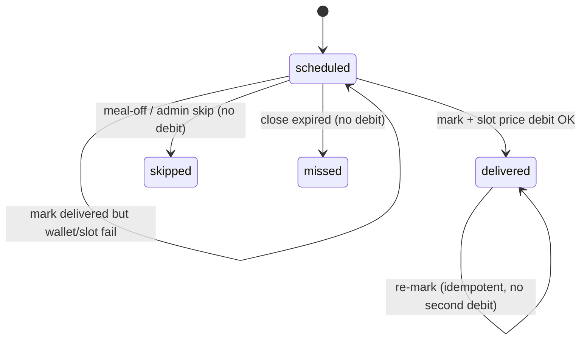

# Meal delivery wallet charge

## Quick summary

When an admin (or any caller using `mark_delivery`) marks an `OrderDelivery` as **`delivered`**, the system debits the customer wallet by the **published menu slot final selling price** for that package’s lunch or dinner on that `service_date` — not the package average `Order.per_meal_price_snapshot`.

Works for **subscription-owned** slots (`order` null) and order-owned slots. On PostgreSQL, `mark_delivery` / `charge_delivered_meal` lock the delivery row only so nullable parent outer joins do not raise a FOR UPDATE error.

Slot final price (frozen at menu publish):

```text
ingredient_cost + per_meal_operational_cost + profit
```

A completed wallet ledger row (`type=payment`) is created and linked on the delivery. `OrderDelivery.charged_amount` stores the debit.

| Action | Endpoint | Who |
|--------|----------|-----|
| Mark delivery | `POST /api/v1/web/orders/{order_public_id}/deliveries/{delivery_public_id}/mark` | Verified admin |
| Mark delivery (shared) | `POST /orders/{order_public_id}/deliveries/{delivery_public_id}/mark` | Verified admin |
| Wallet history | `GET /wallet/transactions/` | Verified customer |

Feature flags:

- `MEAL_DELIVERY_WALLET_CHARGE_ENABLED` (default `True`) — disable all delivery charges.
- `MEAL_DELIVERY_CHARGE_USE_ORDER_AVERAGE` (default `False`) — emergency rollback to charge `Order.per_meal_price_snapshot` instead of slot price.

## Permissions

| Actor | Can mark delivered? | Charged? |
|-------|---------------------|----------|
| Verified admin | Yes | Customer wallet of the order owner |
| Customer | No (403 on mark) | N/A — meal-off uses skip, no charge |
| Unauthenticated | No | N/A |

## Key models / fields

- `MonthlyMenuSlot.final_meal_price_snapshot` — **authoritative charge amount** (set on menu publish).
- `Order.per_meal_price_snapshot` — package **average** estimate at order create (eligibility / display); not used for delivery debit by default.
- `OrderDelivery.charged_amount` — amount debited when charged.
- `OrderDelivery.payment_status` — `not_applicable` \| `charged` \| `failed`.
- `OrderDelivery.wallet_transaction` — FK to the payment debit when charged.
- Idempotency key: `meal-delivery:{delivery.public_id}`.

## Business rules

1. Charge **only** on transition to `delivered`.
2. **No charge** for `scheduled`, `skipped` (customer meal-off or admin), or `missed`.
3. Order create does **not** debit (eligibility minimum balance only).
4. Duplicate mark `delivered` does not double-charge.
5. Insufficient or frozen wallet → mark **rejected** (`422`), delivery stays `scheduled`, no completed payment.
6. Missing published slot or null `final_meal_price_snapshot` → mark **rejected** (`MEAL_SLOT_PRICE_MISSING`); no silent average fallback.

## Request / response

### Mark delivered (success)

```http
POST /api/v1/web/orders/{order_public_id}/deliveries/{delivery_public_id}/mark
Authorization: Token <admin>
Content-Type: application/json

{ "status": "delivered", "note": "" }
```

Response `200` includes delivery with `status=delivered`, `payment_status=charged`, `charged_amount` equal to the slot final price.

### Missing slot price

```json
HTTP 422
{
  "detail": "Published menu slot final price is missing for this delivery; cannot charge wallet.",
  "error_code": "MEAL_SLOT_PRICE_MISSING"
}
```

### Insufficient wallet

```json
HTTP 422
{
  "detail": "Insufficient wallet balance to charge this meal delivery.",
  "error_code": "WALLET_INSUFFICIENT_FOR_MEAL"
}
```

### Frozen wallet

```json
HTTP 422
{
  "detail": "Wallet is frozen and cannot be charged for this meal delivery.",
  "error_code": "WALLET_FROZEN"
}
```

## State transitions



## How to verify

```bash
python manage.py test orders.tests.test_meal_delivery_wallet_payment meals.tests.test_slot_final_price orders.tests.test_full_order_process
```

OpenSpec: `openspec/changes/fix-meal-slot-price-and-menu-isolation/`
