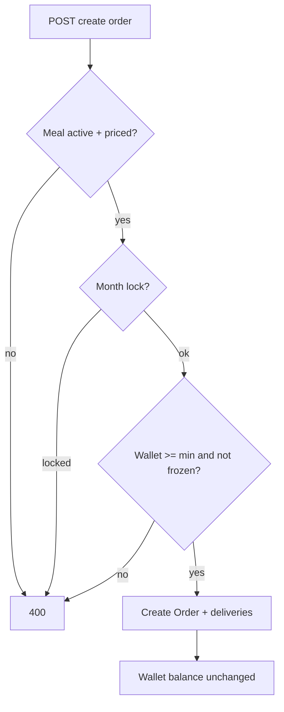

# Order eligibility: month lock + wallet minimum

## Quick summary

Before a verified customer can create a meal package order, the backend applies two eligibility gates (in order):

1. **Same-month package lock** — at most one non-cancelled package per `order_month` (`YYYY-MM`).
2. **Wallet minimum balance** — wallet `balance` must be `>=` admin-configured `min_wallet_balance_to_order` (default `500.00` BDT).

Both gates live in `create_meal_order` (`orders/services/order_service.py`). Passing the wallet gate does **not** debit the wallet and does **not** create a `payment` ledger row.

| Method | Path | Why |
|--------|------|-----|
| `POST` | `/orders/` | Customer creates package order (gates applied) |
| `GET` | `/api/v1/web/orders/order-wallet-settings/` | Admin reads minimum |
| `PATCH` | `/api/v1/web/orders/order-wallet-settings/` | Admin updates minimum |
| `GET` | `/wallet/` | Customer sees `min_wallet_balance_to_order` |

Also mounted at `/orders/order-wallet-settings/` (same view; web path is preferred for admin UI).

## Permissions matrix

| Action | Verified customer | Verified admin | Anonymous |
|--------|-------------------|----------------|-----------|
| Create order | Yes (own) | No (customer path) | No |
| GET/PATCH order-wallet-settings | No | Yes | No |
| Read min on wallet GET | Yes | N/A | No |

## Key models / fields

### `Order` month lock

- `order_month` — `YYYY-MM` from `calculate_order_period`
- Locking statuses: `pending`, `confirmed`, `active`, `completed`
- `cancelled` does **not** lock; customer may place a replacement order for that month

### `OrderWalletSettings` (singleton `pk=1`)

| Field | Type | Default | Notes |
|-------|------|---------|-------|
| `min_wallet_balance_to_order` | Decimal(12,2) | `500.00` | Must be `>= 0`, at most 2 decimal places |
| `updated_at` | datetime | auto | |

Load via `OrderWalletSettings.load()` / `get_order_wallet_settings()`.

### Wallet (read-only for this feature)

- Missing wallet row → treated as balance `0.00` (no auto-create on failed order)
- `status=frozen` → order rejected even if balance ≥ minimum

## Business validation rules

1. Meal must be active and priced (existing).
2. Month lock: reject second non-cancelled order for same `order_month`.
3. Wallet: `balance >= min_wallet_balance_to_order` (inclusive).
4. Frozen wallet: reject.
5. No wallet debit on successful create.

## Request / response examples

### Admin get settings

```http
GET /api/v1/web/orders/order-wallet-settings/
Authorization: Token <admin-token>
```

```json
{
  "min_wallet_balance_to_order": "500.00",
  "updated_at": "2026-07-29T10:00:00.000000+06:00"
}
```

### Admin patch settings

```http
PATCH /api/v1/web/orders/order-wallet-settings/
Authorization: Token <admin-token>
Content-Type: application/json

{ "min_wallet_balance_to_order": "600.00" }
```

### Customer order rejected (insufficient balance)

```http
POST /orders/
Authorization: Token <customer-token>
Content-Type: application/json

{ "meal_public_id": "aaaaaaaa-bbbb-cccc-dddd-eeeeeeeeeeee" }
```

```json
{
  "non_field_errors": [
    "Insufficient wallet balance to place an order. Minimum required is 500.00, current balance is 100.00."
  ]
}
```

### Customer order rejected (month lock)

```json
{
  "non_field_errors": [
    "You already have a meal package for this month. You cannot change meal type within the same month."
  ]
}
```

## Error / status map

| Condition | HTTP | Shape |
|-----------|------|--------|
| Month lock | 400 | `non_field_errors` |
| Insufficient balance | 400 | `non_field_errors` |
| Frozen wallet | 400 | `non_field_errors` |
| Negative settings amount | 400 | field error on `min_wallet_balance_to_order` |
| Non-admin settings | 401/403 | permission denied |

## State / flow



## How to verify

- `python manage.py test orders.tests.test_order_eligibility`
- `python manage.py test orders.tests.test_orders` (month-lock API cases; wallet min set to 0 in setUp)
- Admin: GET defaults → PATCH 600 → customer with 500 balance fails → PATCH 300 → succeeds
- Confirm no `WalletTransaction` with `type=payment` after order create

## Related

- OpenSpec: `openspec/changes/order-eligibility-wallet-min-balance/`
- Frontend: [`../frontend/order-eligibility-wallet-min-balance.md`](../frontend/order-eligibility-wallet-min-balance.md)
- Wallet funding: `wallet/docs/`
