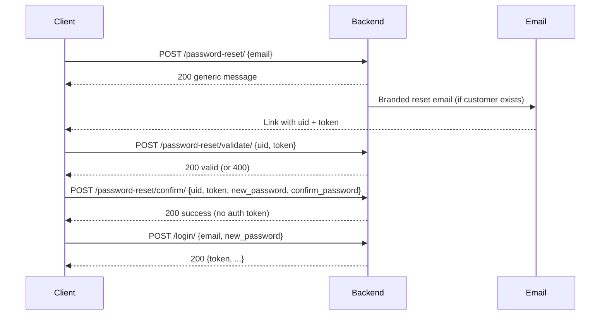

# Customer password reset (backend)

## What is this feature?

Customers who forgot their password can recover access without contacting support:

1. They submit their email.
2. Backend emails a branded reset message with a **deep link** and a **6-digit OTP** (when issuance is allowed).
3. They open the link **or** enter the OTP on the website/app.
4. Client optionally validates the link or OTP (UX only), then submits a new password.
5. Backend updates the password, wipes DRF auth tokens, and the customer logs in again with the new password.

OTP dual-channel details: `user_management/docs/backend/email-verification-otp.md`.

Example: Rahim forgot his password → requests reset → clicks email → sets `NewStrongPassword123` → logs in.

## Who uses which flow?

| Actor | Flow |
|-------|------|
| Customer (web / mobile) | Request → email → validate (optional) → confirm → login |
| Backend | Token generation, email send, password validators, DRF token wipe |
| Admin / Deliveryman | **Out of scope** — no forgot-password APIs in this feature |

## Mental model / important rules

- Reset tokens use Django `PasswordResetTokenGenerator` — **not** the email-activation generator.
- Activation verify **rejects** reset tokens; reset validate/confirm **reject** activation tokens.
- Request endpoint is **anti-enumeration**: same success message whether or not the email exists.
- Confirm does **not** return an auth token. Client must call `POST /user_management/login/`.
- Successful confirm deletes all DRF `Token` rows for that user (old sessions die).
- Changing the password invalidates the reset token (hash is part of the token); it cannot be reused.
- Unverified customers may still reset; login remains blocked until email verification (existing login gate).
- Token lifetime follows Django `PASSWORD_RESET_TIMEOUT` (default **3 days** / 259200 seconds unless overridden in settings).

## Auth, headers, base path

| Item | Value |
|------|--------|
| Base path | `/user_management/` |
| Auth on reset endpoints | Public (`AllowAny`) — **no** `Authorization` header |
| Content-Type | `application/json` |
| Optional | `X-Client-Type: web` or `mobile` |

## Endpoint grid

| Method | Path | Auth | Purpose |
|--------|------|------|---------|
| POST | `/user_management/password-reset/` | Public | Request reset email |
| POST | `/user_management/password-reset/validate/` | Public | Check `uid` + `token` before showing form |
| POST | `/user_management/password-reset/confirm/` | Public | Set new password |
| POST | `/user_management/login/` | Public | Login after confirm (existing) |

## Permissions matrix

| Endpoint | Anonymous | Authenticated customer | Notes |
|----------|-----------|------------------------|-------|
| request / validate / confirm | Allowed | Allowed (treated as public) | No profile required on request |
| login | Allowed | Allowed | Still requires verified email |

## Key models / services

| Piece | Role |
|-------|------|
| Django `User` | Stores hashed password |
| `CustomerProfile` | Eligibility: only users with this profile receive reset mail / can confirm |
| `rest_framework.authtoken.models.Token` | Deleted on successful confirm |
| `user_management.services.password_reset` | Request, validate, confirm, email helpers |
| Templates `emails/customer_password_reset_*` | Branded email HTML/text |

## Business validation rules

### Request
- Body: `email` (required, normalized to lowercase).
- Send mail only if user exists **and** has `customer_profile`.
- Always return the same generic message.

### Validate
- Body: `uid` (uidb64 from email), `token`.
- Success only if customer user resolves and `check_token` passes.
- Does not change password.

### Confirm
- Body: `uid`, `token`, `new_password`, `confirm_password`.
- `new_password` must equal `confirm_password`.
- Password must pass Django validators (same as registration: min length 8, not too common, not entirely numeric, not too similar to user attributes).
- Invalid/expired/wrong-type token → `400` with `{ "detail": "Invalid or expired password reset link." }`.
- On success: `set_password`, save, delete all DRF tokens; return message only.

## Full workflow (API order)



1. **Request** — `POST /user_management/password-reset/`
2. **User opens email** — frontend URL `{FRONTEND_URL}{PASSWORD_RESET_FRONTEND_PATH}?uid=<uidb64>&token=<token>` (default path `/reset-password`)
3. **Validate (recommended)** — `POST /user_management/password-reset/validate/`
4. **Confirm** — `POST /user_management/password-reset/confirm/`
5. **Login** — `POST /user_management/login/` with the new password

## Request / response examples

### 1. Request password reset

```http
POST /user_management/password-reset/
Content-Type: application/json

{
  "email": "customer@example.com"
}
```

**Success `200` (always this shape):**

```json
{
  "message": "If an account exists for this email, password reset instructions will be sent."
}
```

| Field | Meaning |
|-------|---------|
| `email` | Customer account email |
| `message` | Safe copy for UI; does not reveal whether the account exists |

### 2. Validate reset link

```http
POST /user_management/password-reset/validate/
Content-Type: application/json

{
  "uid": "MQ",
  "token": "abc123-def456..."
}
```

**Success `200`:**

```json
{
  "message": "Password reset link is valid."
}
```

**Error `400`:**

```json
{
  "detail": "Invalid or expired password reset link."
}
```

| Field | Meaning |
|-------|---------|
| `uid` | Opaque user id from email query (`uidb64`) |
| `token` | One-time reset token from email query |

### 3. Confirm new password

```http
POST /user_management/password-reset/confirm/
Content-Type: application/json

{
  "uid": "MQ",
  "token": "abc123-def456...",
  "new_password": "NewStrongPassword123",
  "confirm_password": "NewStrongPassword123"
}
```

**Success `200`:**

```json
{
  "message": "Password has been reset successfully. You can now login."
}
```

No `token` field — client must login.

**Mismatch `400`:**

```json
{
  "confirm_password": ["Passwords do not match."]
}
```

**Weak password `400`:**

```json
{
  "new_password": ["This password is too short. It must contain at least 8 characters."]
}
```

**Invalid token `400`:**

```json
{
  "detail": "Invalid or expired password reset link."
}
```

| Field | Meaning |
|-------|---------|
| `new_password` | New password to set |
| `confirm_password` | Must match `new_password` |

## HTTP status map

| Status | When |
|--------|------|
| 200 | Request always (anti-enum); validate OK; confirm OK |
| 400 | Missing/invalid body fields; weak/mismatched password; invalid/expired token |
| 401 | N/A on reset endpoints (public) |

## Settings involved

| Setting | Purpose | Default |
|---------|---------|---------|
| `FRONTEND_URL` | Public site origin for email CTA | env |
| `PASSWORD_RESET_FRONTEND_PATH` | Path segment for reset page | `/reset-password` |
| `PASSWORD_RESET_TIMEOUT` | Django token lifetime (seconds) | `259200` (3 days) if unset |
| `DEFAULT_FROM_EMAIL` / SMTP | Send branded mail | env |

## How to verify

```bash
python manage.py test user_management.tests.test_customer_password_reset --keepdb
python manage.py test user_management.tests.test_branded_auth_emails --keepdb
```

Swagger: `/api/docs/` → tag **Customer Auth** → password-reset request / validate / confirm.

Live email QA:

```bash
python manage.py send_test_auth_email --type password_reset --to you@example.com
```

## Related docs

- Frontend/mobile integration: `user_management/docs/frontend/customer-password-reset.md`
- Branded email layout: `user_management/docs/backend/branded-auth-emails.md`
- Customer auth overview: `docs/customer-auth-api.md`
- OpenSpec: `openspec/changes/customer-password-reset/`
